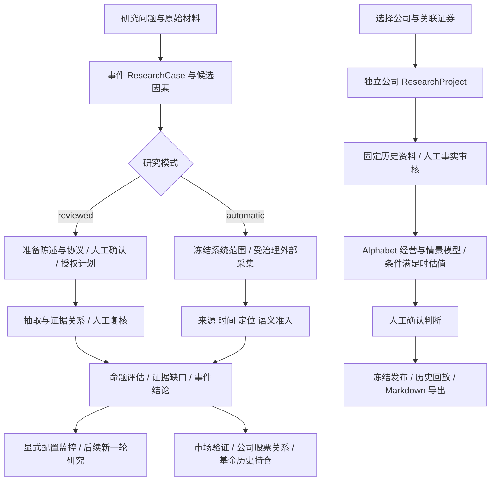

**Fund Engine 当前项目流程与实现逻辑**

梳理日期：2026-09-09。代码基准：当前 checkout，HEAD `16780259`。本文依据当前入口、服务、领域模型、worker 和 API 的静态阅读；未启动服务、读取业务数据库、调用在线模型或重新执行测试。代码存在与流程接线，不代表本机已经配置或完成在线运行。

**目标设计与当前实现的区别（根据后续讨论补充）**

公司研究已有明确目标：[2026-09-03 证据优先的公司研究工作台设计](/Users/xiongjiali/code/fund-engine/docs/superpowers/specs/2026-09-03-evidence-first-company-research-workbench-design.md:9) 及其 [七页、两个工作面的交互原型](/Users/xiongjiali/code/fund-engine/prototype/company-research-workbench/README.md)。应以该原型作为公司研究的实现基准，而不是因为当前仓库同时存在事件研究和 FundClaw Gateway 设计，就重新选择产品方向。

原型主流程是：输入公司/证券及可选问题 → 自动形成有明确证据与缺口的研究初稿 → 阅读商业模式、预测、情景和条件性价值判断 → 保存前集中确认关键输入 → 冻结、回放、比较和导出。规格明确“普通证据不逐条阻塞初稿”；下文记录的“所有事实审核后才开始建模”是当前实现，不是原型要求。公司研究也不以先完成对话 Gateway 或四角色编排为前提。

**1. 项目现在在做什么**

项目的业务重心是证据驱动的投研工作台：保存研究问题，收集并冻结资料，把资料拆成可核对的陈述，判断这些陈述对命题的支持与反驳，保留人工审核和历史版本，随后做持续验证或关联公司、股票、基金披露。

当前有两个主要业务系统：

| 系统 | 研究单位 | 主要问题 | API |
| --- | --- | --- | --- |
| 事件/行业研究 | ResearchCase、Thesis、ResearchRun | 某个现象由什么因素解释？命题得到哪些支持、反证？ | `/api/v1` |
| 公司研究/投资研究底座 | ResearchProject、Company、Security、Revision | 公司怎样赚钱？经营驱动如何传导到现金流与估值？ | `/api/underwriting/v1` |

两者共用数据库与部分任务基础设施，但研究对象、状态和发布版本有各自的模型。公司研究可以独立创建，不需要先创建一个事件 Case；当前也不能把“事件研究完成”视为会自动触发公司建模。

上图中的两条研究线是并列关系。底层正式机制、IndustryState、EarningsEngine 还有其他实现，但没有全部接入这两条产品流程。

**2. 当前从页面能走到哪里**

入口由 [main.tsx](/Users/xiongjiali/code/fund-engine/frontend/src/main.tsx:23) 按 URL 分派。

| 页面 | 当前实际用途 |
| --- | --- |
| `/`、`/?caseId=…` | 真实事件研究列表、创建、详情、材料、准备审核、证据审核、运行与监控 |
| `/events/:caseId/market` | 当前事件的报告主张、关键因素、基本面/市场观察与预测验证 |
| `/events/:caseId/stocks/:instrumentId`、`/funds/:instrumentId` | 当前 Case 关联股票、基金及历史披露；完整路径均以 `/events/:caseId` 开头 |
| `/research`、`/research/new` | 公司目录、对象搜索、公司研究预览与创建 |
| `/research/projects/:projectId` | 公司事实审核、模型、判断确认、冻结发布、回放与导出 |
| `/underwriting/research`、`/:objectId/:versionKind` | 独立研究档案目录与版本查看；详情路径以 `/underwriting/research` 开头 |
| `/?client=mock` | 本地演示工作台，消息与示例数据保存在前端状态 |

默认页面提交的是“标题、粘贴原文、研究问题、3–5 个不重复候选因素、创建人、可选来源链接”，并要求研究协议。没有传 `workflow_mode`，因此采用后端默认的 `reviewed`。后端有自动研究 API，但当前默认创建表单没有自动模式切换或自由对话驱动入口。

依据：[事件创建表单](/Users/xiongjiali/code/fund-engine/frontend/src/workbench/LiveResearchWorkbench.tsx:61)、[后端默认模式](/Users/xiongjiali/code/fund-engine/backend/app/services/event_research.py:73)。

**3. 两条研究线都强调的证据逻辑**

事件账本的核心链条是：

`冻结文档 DocumentVersion → 原文定位 SourceSpan → 原子候选 AtomicClaimCandidate → 正式来源陈述 SourceStatement → 证据关系 EvidenceLink → 冻结证据快照 EvidenceSnapshot → AI 评估 AIAssessment → 人工决定 ReviewDecision`

- **冻结文档**：保存内容哈希、来源、公开/可用/获取时间、解析器和版本关系。新资料或补充正文创建新记录，保留旧原件。
- **原文定位**：原文片段有页、段落、字符区间等 locator；候选引文必须等于原文中连续的一段文字，并有内容哈希。
- **来源陈述**：记录“来源说了什么”，区分披露事实、转述、管理层归因、预测、研究意见。非一手来源不能仅凭模型输出就变成披露事实。
- **证据关系**：解释某条陈述为什么支持、反驳或补充一个命题，并记录作用范围。搜到相似文字，只意味着它可进入候选集合。
- **AI 评估**：对固定证据集合给出 supported、contradicted 或 insufficient_evidence，保留 rationale 和 gaps。AI 输出永久保留临时判断标记。
- **人工决定**：追加确认、修改或拒绝的记录，不覆盖原来的机器输出。

人工路径通过审核发布正式陈述和关系；自动路径另有 AutomaticAdmissionDecision，检查来源、时间、定位和语义一致性后准入，仍明确标记为机器准入，不能伪装成人工审核。

历史读取同时考虑来源可用时间、相关账本记录产生时间与冻结边界；不是把今天的最新数据直接贴上过去日期。研究结论、证据关系、来源陈述和原文也不是同一层对象。

依据：[账本模型](/Users/xiongjiali/code/fund-engine/backend/app/models/ledger.py:232)、[原子候选校验](/Users/xiongjiali/code/fund-engine/backend/app/services/atomic_claims.py:96)、[自动发布门禁](/Users/xiongjiali/code/fund-engine/backend/app/services/atomic_claims.py:271)、[评估与人工审核](/Users/xiongjiali/code/fund-engine/backend/app/services/assessment.py:25)。

**4. 事件研究：人工审核模式 reviewed**

1. **创建研究并留住原材料。** 冻结文档，建立 Case、租户准入、事件简报和因素命题，保存研究范围。粘贴材料可以成为研究线索，能否进入正式证据仍受来源与权限检查。
2. **进入三段准备。** 准备 worker 依次生成原子陈述、研究协议、补证计划。用户确认/修订/驳回陈述，核对结果指标、范围、基线、机制与验证规则，最后明确授权补证计划。
3. **检查研究是否具备条件。** 缺结果绑定、机制模板、验证规则或反向假设会 blocked；特定业务线只有不足数量的主指标时，只能 single_metric_monitoring，其正式评估结论必须是证据不足；完整协议才是 ready。
4. **授权后建立 ResearchRun。** Run 下分研究任务，经过已归档资料抽取、相关陈述召回、证据关系提议、人工复核、评估。遇到待审核内容会等待，不把队列等待当成失败。
5. **形成两层结果。** 命题层由模型生成 AIAssessment；事件汇总草稿当前按已审核证据的 supports +1、contradicts −1 计分，选择正分最高因素并拼接固定文案。它不是另一个完整的因果推理模型。
6. **人工结论决策与后续版本。** 后端有事件结论的人工决策/发布及后续变化逻辑；当前事件前端尚未把公司研究式的发布、冻结回放、Markdown 导出全部接回来。页面已明确提示研究消息、已发布事件的材料比较/结论决策补料入口未接入。

准备计划会保存证据目标、来源、优先级、停止条件和预算。但当前授权到通用 Run 时主要传递因素范围与汇总预算，尚未把每个计划项目完整编译成外部采集任务。reviewed 执行主体主要围绕已有归档资料推进，不能直接等同于 automatic 外部采集流程。

依据：[准备授权](/Users/xiongjiali/code/fund-engine/backend/app/services/research_preparation.py:790)、[协议门禁](/Users/xiongjiali/code/fund-engine/backend/app/services/research_protocol.py:347)、[事件结论计分](/Users/xiongjiali/code/fund-engine/backend/app/services/event_conclusion.py:81)、[前端操作边界](/Users/xiongjiali/code/fund-engine/frontend/src/workbench/ResearchActions.tsx:90)。

**5. 事件研究：自动模式 automatic**

`POST /api/v1/automatic-research` 接收一段输入，由提取器识别 topic/material、公司、代码、问题和因素。自动创建时冻结系统生成的范围、协议和证据计划，直接排研究 Run。材料型输入会先处理用户提供的材料；外部补证按照“因素 × 支持/反驳/替代解释”等目标创建 AcquisitionJob。

采集任务依次执行：查询规划 → 提供商/官方源检索 → 获取原始资料 → 保存 RetrievalArtifact → 解析冻结文档 → 抽取原子候选 → 自动准入检查 → 建立正式陈述及证据关系。当前网络适配器主要是 Gildata、上交所、深交所，受来源策略和主机范围限制。找到了链接、下载了文件、解析成功、准入成功是不同状态；拒绝和失败也保留记录。

研究 worker 在 waiting_for_sources 时让出执行，采集任务达到可恢复研究的状态后重新排队。随后为每个因素生成评估，从这些评估和精确证据引用确定性拼接本轮结论，附带失败、取消、部分采集及证据缺口。结果保持 system_generated/未经人工审核的语义。

缺证据可能进入后续轮次，automatic Run 最多三轮，且需要剩余额度容纳下一轮；无可用证据会失败，有证据则可能带缺口完成。现有补轮会保存 gap，但外部查询仍主要由实体、因素文本、时间和固定目标词构造；尚不能称为完整的“围绕每个缺口自主改写检索策略”。这个 Run 内的轮数也不能直接等同 reviewed Case 的全部后续研究周期。

取消研究 Run 会取消对应研究任务和通用 Job；目前该入口没有级联取消 AcquisitionJob，也不能保证立即中断正在进行的外部请求。专用 automatic retry 会复制失败运行的原冻结范围与限制，创建新 Run，保留旧记录。更换研究范围会使用版本/归属检查，防止旧任务结果写进新的范围。

几个状态层不能混用：准备流程等待陈述/协议/计划确认；reviewed Run 可 waiting_for_review；automatic Run 可 waiting_for_sources；AcquisitionJob 的 partial 可能表示有文件但没有准入证据；自动结果 completed 不等于人工结论 published。

依据：[自动管线](/Users/xiongjiali/code/fund-engine/backend/app/services/automatic_research_pipeline.py:350)、[结论拼接](/Users/xiongjiali/code/fund-engine/backend/app/services/automatic_research_conclusion.py:57)、[Run 取消范围](/Users/xiongjiali/code/fund-engine/backend/app/repositories/auto_research.py:320)。

**6. 持续监控与市场、基金分支**

监控由用户显式配置：选择已确认因素、允许来源、频率、额度、下一验证事件。每次配置或暂停/恢复追加一个配置版本。研究 worker 同时检查到期监控并发起新 Run；当前调度是固定的上海时间规则并有每日去重，不是持续行情流。发布事件结论不会自动建立监控；默认 automatic 因素也不等于已通过人工确认、可直接加入监控。

市场研究分支围绕当前 Case 建立以下关系：

`已审核来源陈述 → 报告主张 → 关键因素及支持/反驳条件 → 后续实际观察/验证 → 公司与股票绑定 → 基本面影响和市场表现 → 基金历史持仓披露`

预测验证先冻结预期值、指标、期间、比较规则和容差，再录入实际值。程序计算“是否满足冻结规则”的候选结果，人工再确认或修改裁决；数值吻合本身不建立因果关系。

基金披露同步会冻结基金/股票范围和报告期，确认供应商能力，匹配同基金同报告期披露，保留公开日期、更正版本和展示权限。基金主题敞口根据截止时点可见的持仓披露与主题关联股票计算，保留每个权重对应的披露记录。它反映历史披露，存在报告期、公开日期和资料新鲜度限制。

依据：[监控配置](/Users/xiongjiali/code/fund-engine/backend/app/services/case_monitor.py:82)、[worker 调度](/Users/xiongjiali/code/fund-engine/backend/app/scripts/run_research_worker.py:46)、[市场研究服务](/Users/xiongjiali/code/fund-engine/backend/app/services/market_expression.py:103)、[预测规则](/Users/xiongjiali/code/fund-engine/backend/app/services/forecast_verdicts.py:77)、[基金同步](/Users/xiongjiali/code/fund-engine/backend/app/services/fund_disclosure_sync.py:139)、[披露敞口](/Users/xiongjiali/code/fund-engine/backend/app/services/exposure.py:88)。

**7. 独立公司研究：当前最完整的专用闭环**

1. **选择对象。** 搜索 Company、Security 或 Industry，最终选择 Company 及其关联证券，校验该历史时点有效身份。
2. **预览研究方案。** 当前固定默认策略包括五年期限、CNY 计价、12% 必要回报、25% 永久损失上限及研究模块。用户确认预览 hash 后幂等初始化项目、历史边界、mandate、scope、agenda、draft、preparation 和 Job。
3. **编译来源与事实索引。** 专用 company-research worker 先准备证据，进入 awaiting_evidence_review。逐条 confirmed/rejected，全体处理后才进入模型构建；拒绝的事实不会进入模型，但可能留下缺口。
4. **构建经营模型。** 已确认事实、明确策略假设、受治理模型模板和固定市场输入，编译为 business_map、driver_map、financial_bridge、scenario_set、可选 valuation_set、research_gaps、judgment_context 和 memo。
5. **计算情景与估值。** Alphabet 专用确定性引擎计算 base/bull/bear 五年情景、现金流桥、DCF、反向 DCF、证券价值/回报区间，处理 GOOG/GOOGL、股本类别和 USD/CNY。关键事实、现金流桥或市场桥不完整时，返回 not_answerable，估值为空。
6. **人工确认研究判断。** 模型完成后等待判断审核。确认必须绑定当前 draft、memo ID/hash 和 Markdown，追加人工确认记录。
7. **冻结发布。** 先预览再发布，校验 manifest hash、lock version 和幂等键。冻结身份、时点、材料/模型/市场引用、判断与 memo，保存父版本关系。
8. **回放与导出。** 根据冻结引用验证历史版本，确定性生成 Markdown。前端发布后会重新读取冻结版本，导出前核对哈希再下载。

当前状态链：`queued → preparing_sources → awaiting_evidence_review → building_model → awaiting_judgment_review → ready_to_freeze → completed`，另有可恢复失败与 blocked。

这个闭环有两项重要范围限制：

- 只注册 Alphabet adapter。材料、策略与市场输入受内置 golden-case fixture 约束，固定截止时点为 2026-08-25 23:59:59 UTC；请求更晚日期仍归一化到这个时点，请求更早会拒绝。因此“真实 API、真实持久化”不能解释成已支持任意公司、任意历史时点的在线自动研究。
- answerable/partially_answerable 默认 assessment 仍为 provisional_neutral、low；not_answerable 不给方向或置信度。估值能力和成熟的自动方向性评级是不同完成度。页面中的行业/竞争/监管、事实冲突组、逐情景财务效果也有尚未提供的模块。

依据：[公司初始化与适配器](/Users/xiongjiali/code/fund-engine/backend/app/underwriting/services/company_research_initializer.py:116)、[固定时点](/Users/xiongjiali/code/fund-engine/backend/app/underwriting/services/company_research_boundary.py:71)、[公司引擎](/Users/xiongjiali/code/fund-engine/backend/app/underwriting/services/company_research_engine.py:55)、[评估默认值](/Users/xiongjiali/code/fund-engine/backend/app/underwriting/domain/company_research.py:1853)、[前端发布回放导出](/Users/xiongjiali/code/fund-engine/frontend/src/features/investment-research/ResearchWorkbenchPage.tsx:643)。

**8. 通用研究底座、行业模型与档案的完成度**

| 模块 | 当前状态 |
| --- | --- |
| 通用 `/product` | 已有身份、项目、策略/范围/议程、草稿、市场快照和冻结发布底座；通用发布仍固定 not_answerable，model_refs 为空、memo_ref 为空，方向性评估未实现 |
| 正式 Mechanism | 有严格的编译与校验模块，要求来源、人工确认、适用/失效条件、财务映射、替代解释和可证伪条件 |
| IndustryState | 有动力电池需求、有效产能、利用率、库存、价格/成本、利润池及情景计算模块 |
| EarningsEngine | 有分部收入、成本、营业利润、NOPAT、FCF 与公司总量对账模块 |
| 上述正式行业计算链 | 当前未发现其主要编译入口被产品 handler/worker 串成完整流程；主要直接调用在测试中，不能画成 Alphabet 的实际中间步骤 |
| CATL baseline | 当前 HTTP 是证据展示，formal_mechanisms 为空、valuation 为空、wait_for_validation |
| 行业候选 dossier | 冻结来源与定位，provenance/methodology 两名不同审核者通过后可发布候选；发布仍是 not_answerable，不自动升级为正式机制或行业状态 |
| 研究档案 | 已有真实读取页面：版本时间线、相邻差异、来源父图、边界、行业候选证据；与 CompanyResearch 项目版本是不同读取接口，档案页自身没有导出/编辑按钮 |

依据：[通用发布器](/Users/xiongjiali/code/fund-engine/backend/app/underwriting/services/revision_publisher.py:50)、[机制编译](/Users/xiongjiali/code/fund-engine/backend/app/underwriting/services/mechanism_compiler.py:619)、[行业状态](/Users/xiongjiali/code/fund-engine/backend/app/underwriting/services/industry_state.py:389)、[盈利引擎](/Users/xiongjiali/code/fund-engine/backend/app/underwriting/services/earnings_engine.py:194)、[候选证据](/Users/xiongjiali/code/fund-engine/backend/app/underwriting/services/candidate_evidence.py:101)、[档案页面](/Users/xiongjiali/code/fund-engine/frontend/src/features/underwriting/ResearchArchivePage.tsx:1047)。

**9. 系统怎么运行与留痕**

前端是 React 18/Vite/TypeScript，后端是 FastAPI/SQLAlchemy/Alembic，关系数据库保存研究账本、草稿与任务状态。正式证据、评估、审核、冻结版本等核心表只追加；任务运行状态和工作草稿有自己的可变模型，不是所有表都不可变。Neo4j 是可从账本重建的可选图投影。

默认一键 Compose 定义 PostgreSQL、迁移/文件目录初始化、API、前端、研究 worker、采集 worker、公司研究 worker。reviewed 的研究准备还有独立 preparation worker 脚本；当前 Compose 没有包含它，使用该流程时需要另行运行。只有 API 启动，并不能保证后台研究会推进。

任务通过持久化 Job/ResearchRun/ResearchTask、事件记录、认领 token/lease、版本校验、失败恢复等机制协作。材料和研究结果属于持久数据；前端通过 HTTP 读取状态，不能靠一次页面提示判断后台任务完成。

事件 API 的主要访问控制通过服务端 Bearer 映射租户，再按 Case 准入与从属关系校验。资料另外带有 AI 处理、展示、导出、API 使用和留存权限。操作人字段与可信租户身份是不同概念；这些检查也不能替代尚未完成的全路由权限审计。

模型客户端使用 OpenAI 兼容 JSON 协议；非测试环境缺凭证会失败，只有 test 环境允许确定性 mock。抽取、证据提议与评估会做 schema/引用检查，拒绝截断和 refusal；有界重试、单次输入/输出规模和生成 token 上限。事件评估文本还有规则式非投顾表达门禁，但这是事件 AI 文本链的机制，不能概括为整个 underwriting 都禁止估值。

Run 与 Case 已有已记录 token 用量汇总及页面。它只统计已持久化、明确归属的调用；缺失用量不是零，取消、回滚、崩溃与未接入路径可能留下缺口，尚不是完整货币账单或总任务费用门禁。

补充读取能力包括搜索、图谱、公司/主题浏览、基金穿透、历史比较和研究效能 KPI。证据召回使用本地 BM25、字符 n-gram TF-IDF 与排名融合，当前不是一个依赖在线 embedding 的向量检索服务；相似度只用于召回排序，不保存成证据强度。

依据：[运行拓扑](/Users/xiongjiali/code/fund-engine/docker-compose.one-click.yml:81)、[模型调用边界](/Users/xiongjiali/code/fund-engine/backend/app/ai/client.py:164)、[用量汇总](/Users/xiongjiali/code/fund-engine/backend/app/queries/run_ai_usage.py:8)、[召回](/Users/xiongjiali/code/fund-engine/backend/app/services/recall.py:1)、[图投影](/Users/xiongjiali/code/fund-engine/backend/app/services/projection.py:1)。

**10. 对当前逻辑的判断**

项目最明确的主线是“证据如何成为可审核、可回放的研究判断”。当前默认页面承载人工审核事件研究，后端另外有受治理自动研究；独立公司研究则把范围收紧到 Alphabet，完成了审核到冻结导出的专用闭环。

现在理解项目最容易出错的地方，是把不同阶段、不同系统的能力叠加成一个已经完成的通用产品：把默认页面等同于自动采集，把准备计划等同于完整执行计划，把行业候选发布等同于正式行业模型，把 CompanyResearch 估值等同于成熟方向性评级，或者把所有版本接口等同于同一档案。

README 和较早审计报告有明显滞后：其中“公司完整闭环/归档页面仍缺失”等描述已被当前代码和后续路线记录更新；另一方面，当前恢复的市场页面与局部真实浏览器测试仍不足以证明旧事件全链验收完整恢复。本文保留这两面的区别，不使用历史测试数量作为本次验收结果。
