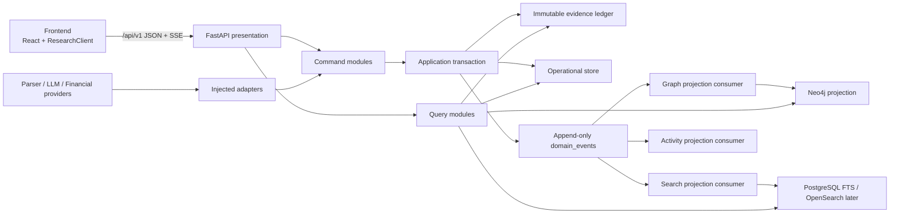
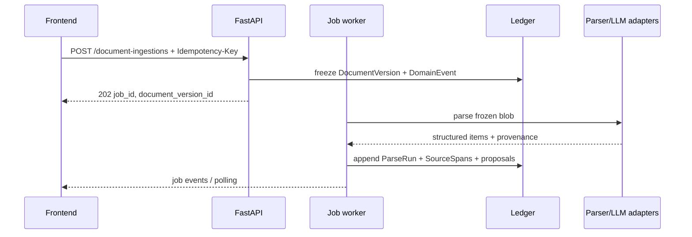
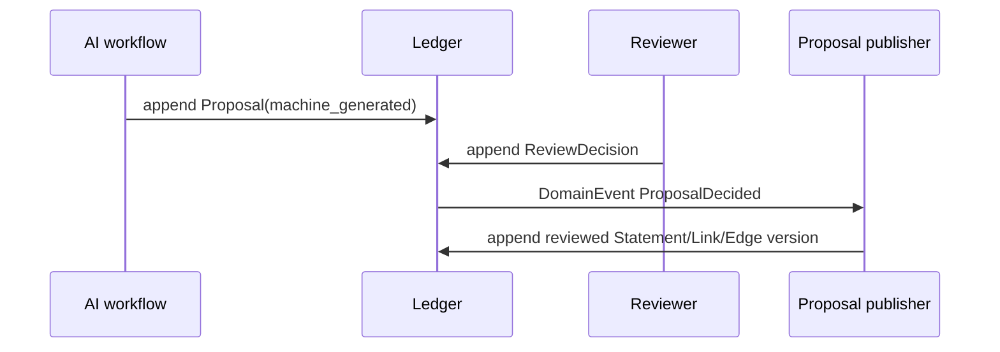

# Fund Engine 后端能力与接口设计

> 状态：已确认的目标设计，尚未实施
>
> 日期：2026-07-31
>
> 范围：独立后端设计；前端只通过版本化 HTTP 契约接入
>
> 对应原型：研究总览、案例档案、连续关系画布，以及已补充的资料库与审核队列

## 1. 结论

采用 **模块化单体 + 页面查询接口 + 统一命令/审核接口**。

- FastAPI 是唯一业务入口，前端不直接访问 PostgreSQL、Neo4j、对象存储、LLM 或金融数据供应商。
- PostgreSQL 中的不可变证据账本是事实源。
- 任务、作业、权限、认领、通知等运营状态进入独立 operational store；这些状态允许受控更新，同时用不可变领域事件保留审计历史。
- Neo4j、全文搜索索引、活动流和前端关系图均为可重建投影。
- AI 只生成 `Proposal` 和显著标记为“未经人工复核”的 `AIAssessment`；正式证据关系必须由人工决定产生。
- 不拆微服务。只有当数据量、团队边界或独立扩缩容形成真实需求时，才沿本文定义的 seam 拆分。

目标不是把现有 `/workbench` 扩成万能接口，而是用少量深模块承接 prototype 的真实工作流。

## 2. 产品边界

### 2.1 本期必须完整支撑

1. 研究总览：当前案例摘要、任务队列、证据变化、活动流。
2. 案例档案：案例/命题导航、当前判断、因果链、支持/反证/背景、缺口与研究日志。
3. 连续关系画布：冻结原文到命题、因果环节、公司、股票、基金的连续路径。
4. 资料库：文档检索、冻结版本、解析状态、SourceSpan、引用反查和原文定位。
5. 审核队列：Statement、EvidenceLink、CausalEdge、EntityAlignment 四类 AI 提议的人工处理。
6. 全局搜索：案例、命题、证据、公司、股票、基金分组搜索。
7. 历史回放：所有上述读模型共享同一个 `cutoff` 语义。

### 2.2 本期只预留接口

- 公司库、股票库、基金库的完整工作台。
- 自动监控、通知订阅和预警规则编辑。
- 多租户计费、外部开放平台和移动端专用接口。
- 投资推荐、目标价、仓位和买卖指令。

## 3. 当前实现审计

### 3.1 已有能力

| 能力 | 当前实现 | 判断 |
|---|---|---|
| 不可变证据账本 | 19 张 SQLAlchemy 表，应用 guard；PG 迁移含 UPDATE/DELETE trigger | 可复用 |
| 文档冻结 | 内容 SHA-256 去重、版本追加、SourceSpan | 可复用，但元数据和原文存储不足 |
| 研究模型 | ResearchCase、Thesis、CausalStep/Edge、SourceStatement、EvidenceLink | 可复用，需版本化与统一审核 |
| AI 判断 | EvidenceSnapshot、AIAssessment、ReviewDecision | 可复用，ReviewDecision 当前只覆盖 assessment |
| AI 引擎 | extract → propose → assess，AIRun 审计 | 可复用，当前是同步脚本而非可恢复作业 |
| 历史截点 | EvidenceLink 与持仓按 cutoff 过滤 | 部分完成，未统一覆盖全部对象 |
| 股票/基金穿透 | Company、Stock、Fund、ValuationSnapshot、HoldingDisclosure、ThemeRole | 底座存在，来源回链与身份对齐不足 |
| 图投影 | Neo4j 全量重建；工作台可直接从账本组图 | 可复用，缺增量水位与完整连接边 |
| 数据源 | 聚源 MCP：研报、公告、行情 | 已有只读适配器，仍是固定查询 CLI |
| 测试 | 后端 `51 passed, 2 skipped` | SQLite 聚焦测试通过；PG/Neo4j 集成测试未在本轮运行 |
| 真实切片 | evidence_gate.db：7 文档、34 span、15 statement/link、3 thesis、3 公司、2 基金 | 是冻结样例/种子，不等同持续运营数据 |

### 3.2 当前真实接口

只有：

- `GET /health`
- `GET /api/research-cases/{case_id}/workbench?cutoff=`

现有前端 `ResearchClient` 声明了 9 项能力，但默认仍注入 `MockResearchAdapter`；`HttpResearchAdapter` 尚不存在。因此 prototype 页面视觉存在，真实后端闭环尚未接通。

### 3.3 关键结构性缺口

1. `/workbench` 只取案例的 latest thesis，不能按 `thesis_id` 导航，也不能支撑多案例列表。
2. 图中缺少 `case → thesis`、`company → stock` 等连接，证据簇与基金持仓簇可能在数据上断开。
3. DocumentVersion 没有标题、发布者、文档类型、MIME、原始 blob、解析状态、失败阶段和页数。
4. `SourceSpan.locator` 是无版本自由 JSON，无法保证页码、坐标、字符区间和逐字文本可往返定位。
5. 原始文档没有独立对象存储引用；只保留 span 文本，无法可靠打开完整原文或附件。
6. EvidenceLink 的 `review_state` 被写进不可变行，但没有 `supersedes_id`，状态无法合法演进。
7. ReviewDecision 只能审核 AIAssessment，不能审核 Statement、EvidenceLink、CausalEdge 或实体对齐。
8. 缺统一 `Proposal`，AI 当前可以直接创建 machine-generated 正式领域行。
9. EvidenceSnapshot 用 JSON 保存 link IDs，缺外键完整性、顺序、证据角色快照和 citation manifest。
10. AI proposer 从全库最多取 20 条 SourceStatement，没有 case、文档集合、cutoff 或检索范围约束，存在跨案例和未来信息污染风险。
11. AI 运行只有最终 AIRun，没有 queued/running/progress/retry/cancel/waiting_for_review。
12. 没有首页任务、活动、变化、全局搜索、权限、认领、并发审核和幂等写接口。
13. Workbench 中估值未按 cutoff 截断，ThemeRole 未统一按有效期过滤，时间语义尚未集中管理。
14. 持仓行缺 `DocumentVersion/SourceSpan` 回链、份额类别、币种、持仓数量和 provider record ID。

## 4. 总体架构



### 4.1 前后端分离规则

前后端的 seam 是 `/api/v1` 的 OpenAPI 契约。

前端必须：

- 只依赖 `ResearchClient` 的领域类型。
- 用 `HttpResearchAdapter` 把 HTTP DTO 映射为前端类型。
- 不导入后端生成的 ORM 类型，不感知表名、Neo4j label 或供应商字段。
- URL 中保存 `case_id / thesis_id / view / focus / step / cutoff / cursor` 等可分享状态。

后端必须：

- 使用 Pydantic request/response schema；路由不返回任意 `dict`。
- 所有响应包含 `schema_version`；历史读响应包含 `basis`。
- 不按某个 React 组件形状暴露内部数据，也不返回数据库行。
- API 演进采用 additive change；破坏性修改进入 `/api/v2`。
- CORS 只负责浏览器边界，不替代身份认证和对象授权。

推荐前端接入结构：

```text
frontend/src/data/
  researchClient.ts        # 稳定领域接口
  mockResearchAdapter.ts   # 原型/状态测试
  httpResearchAdapter.ts   # 唯一 HTTP 转换层
  dto/v1.ts                # 后端 wire DTO
  mappers/*.ts             # DTO -> frontend domain
```

## 5. 后端模块

### 5.1 DocumentLibrary module

**接口**：冻结材料、解析材料、列出版本、读取 span、生成受权原文访问地址、反查引用。

隐藏：对象存储、Docling、OCR、locator 标准化、哈希去重、失败重试。

核心不变量：

- `DocumentVersion` 内容寻址且不可变。
- 每个 `SourceSpan` 必须通过 locator round-trip 校验。
- 解析失败不删除 DocumentVersion，只追加 ParseRun 结果。

### 5.2 ResearchDossier module

**接口**：创建/读取 ResearchCase，追加 ThesisVersion、CausalStepVersion，按 basis 组装 dossier。

隐藏：最新有效版本选择、竞争解释、缺口聚合、研究日志投影。

核心不变量：Thesis 必须可证伪、有适用期；修改产生新版本，不覆盖旧版本。

### 5.3 ProposalReview module

**接口**：创建 Proposal、读取待审队列、追加 ReviewDecision、发布正式领域对象。

支持四类 proposal：

- `statement`
- `evidence_link`
- `causal_edge`
- `entity_alignment`

核心不变量：AI proposal 永不自动变成 reviewed relation；同一 proposal 的并发决定必须由 expected version 防冲突。

### 5.4 Assessment module

**接口**：冻结 snapshot、生成 provisional assessment、追加 assessment review、历史读取。

核心不变量：

- snapshot 只能包含 `available_at <= cutoff` 且符合权限和范围的证据版本。
- 结论只有 `supported / contradicted / insufficient_evidence`。
- 不产生 maturity score、`ready_for_review` 或自动送审信号。

### 5.5 RelationshipGraphQuery module

**接口**：按 case、thesis、cutoff、focus 和 depth 返回连续子图与结构化路径。

隐藏：读 PostgreSQL 还是 Neo4j、分页切片、节点/边去重、projection watermark。

必须存在的正式边：

```text
DocumentVersion -> SourceSpan -> SourceStatement
SourceStatement -> EvidenceLink -> ThesisVersion
ResearchCase -> ThesisVersion
ThesisVersion -> CausalStepVersion -> CausalEdgeVersion
CausalStepVersion/ThesisVersion -> ThemeRoleVersion
ThemeRoleVersion -> Company -> Stock
Fund -> HoldingDisclosure -> Stock
Stock -> ValuationSnapshot
```

前端可以画成一张连续图，但每种边的证明含义不同；图可见不等于关系已审核。

### 5.6 ExposureQuery module

**接口**：按 `as_of` 查询公司、股票、估值和基金披露暴露，并返回每行来源。

核心不变量：

- 可见性由披露日决定，不由报告期决定。
- 展示文字必须是“披露持仓”，不能称实时持仓。
- 每个权重回到特定 HoldingDisclosure 和原始披露文档。

### 5.7 JobOrchestration module

**接口**：提交、查看、取消和重试 ingest/extract/propose/assess/project 作业。

首版用 PostgreSQL job table + worker；达到长暂停、多 provider 或频繁恢复需求后，可在该 seam 后替换为 Temporal。AI 内部图需要 checkpoint 时可使用 LangGraph，但正式审核仍写本系统账本。

### 5.8 SearchActivity module

**接口**：分组搜索、证据变化和活动 cursor feed。

首版使用 PostgreSQL FTS/trigram；后续数据量触发时增加 OpenSearch adapter。搜索索引和活动流都由 `domain_events` 重建。

## 6. 数据模型调整

### 6.1 不可变证据账本

保留并增强：

| 对象 | 调整 |
|---|---|
| DocumentVersion | 增加 source_id、title、publisher、document_type、mime_type、blob_ref、byte_size、language、page_count、metadata_schema_version |
| SourceSpan | locator 改为版本化 `SourceLocatorV1`；增加 text_sha256、context_hash |
| ResearchCaseVersion | 从当前 ResearchCase 的可变描述中分离版本；含 summary、status、supersedes_id |
| ThesisVersion | 增加 applicable_from/to、falsifiers、supersedes_id |
| CausalStepVersion | 增加 supersedes_id、scope、valid period |
| CausalEdgeVersion | 增加 proposal_id、review_decision_id、valid period、supersedes_id |
| SourceStatementVersion | 增加 proposal_id、review_decision_id、supersedes_id、unit/metric definition 可选结构 |
| EvidenceLinkVersion | 由审核决定发布；增加 applicable_from/to、proposal_id、review_decision_id、supersedes_id |
| EvidenceSnapshotItem | 替代 JSON ID 数组，使用 snapshot_id + entity_type + entity_version_id + ordinal + content_hash |
| CitationManifest | 内容寻址保存 snapshot 使用的文档、span、statement、link 版本与哈希 |
| AIAssessment | 增加 ai_run_id、citation_manifest_id；保持 provisional |
| HoldingDisclosure | 增加 document_version_id/source_span_id、provider_record_id、currency、position、share_class_id |
| InstrumentIdentifier | 内部 instrument 与外部代码的带来源、有效期映射 |
| AIRun | 增加 job_id、agent_ref、code_version、input/output entity IDs、token/cost 可选审计 |
| DomainEvent | 同事务追加的 outbox/event，供投影、活动和搜索消费 |

### 6.2 通用提议与人工决定

```text
Proposal
  id
  kind
  payload
  target_context
  proposed_by_type
  proposed_by_ref
  proposed_at
  basis_cutoff
  input_entity_ids
  content_hash

ReviewDecision
  id
  proposal_id
  outcome: confirmed | modified | rejected
  replacement_payload?
  reason
  reviewer_id
  decided_at
  expected_proposal_version
```

`modified` 不修改 Proposal，而是让发布器根据 `replacement_payload` 追加正式版本。`rejected` 也保留原提议和理由。

现有 assessment review 可以迁移为 `proposal_kind=ai_assessment`，但产品界面仍明确区分“审核证据关系”和“复核 AI 判断”。

### 6.3 Operational store

这些不是证据事实，不应强制全部 append-only：

| 表 | 用途 |
|---|---|
| jobs | 当前状态、step、progress、attempt、错误、取消标志 |
| job_events | 不可变进度历史，供 SSE/cursor 重放 |
| review_assignments | 认领人、租约、到期时间 |
| task_items | 首页任务队列、优先级、状态、负责人 |
| users / roles / memberships | 身份和 case 级权限 |
| projection_checkpoints | consumer 水位、schema version、最近错误 |
| idempotency_keys | 写请求去重及响应缓存 |

运营表的每次业务变化同时追加 DomainEvent，用户活动不依赖临时日志文本。

### 6.4 SourceLocatorV1

```json
{
  "schema": "source-locator/v1",
  "document_sha256": "...",
  "page": 4,
  "bbox": {"l": 90, "t": 280, "r": 506, "b": 306, "origin": "top-left"},
  "text_position": {"start": 412, "end": 795},
  "text_quote": {"exact": "...", "prefix": "...", "suffix": "..."},
  "parser_item_ref": "#/texts/57",
  "parser_version": "docling-x.y.z"
}
```

`document_sha256 + page/bbox + text_quote + offsets` 组合使用。解析器升级后 locator 仍属于旧 DocumentVersion/ParseRun，不原地重写。

## 7. API 通用契约

### 7.1 基础约定

- Base path：`/api/v1`
- JSON 字段：`snake_case`
- 时间：ISO-8601，必须带时区；业务日期使用 `YYYY-MM-DD`
- ID：后端 UUID；外部证券代码不得充当内部主键
- 列表：opaque cursor，不使用 offset 深分页
- 写请求：必须带 `Idempotency-Key`
- 并发决定：必须带 `expected_version`
- 认证：OIDC/JWT adapter；本地开发可使用显式 dev principal
- 授权：case/document/proposal 级校验，不能只隐藏前端按钮

### 7.2 HistoricalBasis

所有支持历史回放的响应返回：

```json
{
  "basis": {
    "cutoff": "2024-05-31T23:59:59+08:00",
    "is_historical": true,
    "ledger_high_watermark": "event-uuid",
    "projection_built_at": "2026-07-31T12:00:00+08:00",
    "projection_schema_version": "graph/v1"
  }
}
```

`cutoff` 决定当时可见的业务事实；search PIT 或 projection watermark 只决定一次读取是否稳定，不能替代 cutoff。

### 7.3 错误格式

```json
{
  "error": {
    "code": "review_conflict",
    "message": "proposal has already been decided",
    "request_id": "...",
    "details": {"current_version": 2}
  }
}
```

标准错误：

- `400 invalid_request`
- `401 unauthenticated`
- `403 permission_denied`
- `404 not_found`
- `409 idempotency_conflict | review_conflict | version_conflict`
- `422 validation_failed`
- `429 provider_rate_limited`
- `503 backend_unavailable | provider_unavailable | projection_stale`

内部异常、prompt、token、供应商密钥和原始堆栈不得返回前端。

## 8. 页面查询接口

### 8.1 研究总览

`GET /api/v1/overview?case_id=&cutoff=`

返回：

- 当前 ResearchCase 摘要和当前 ThesisVersion
- 当前正式判断与 provisional AI 判断边界
- `key_changes`
- `framework`
- `totals`
- `task_queue`
- `evidence_changes`
- `activity`
- `basis`

这是首页 query module，不从前端并发拼十几个底层接口。任务、活动和证据变化可各自使用后续 cursor 接口加载更多。

### 8.2 案例列表与档案

| 方法 | 路径 | 能力 |
|---|---|---|
| GET | `/api/v1/research-cases?query=&status=&cursor=` | 案例导航列表 |
| POST | `/api/v1/research-cases` | 创建持久研究档案 |
| GET | `/api/v1/research-cases/{case_id}/dossier?thesis_id=&cutoff=` | prototype 案例档案完整读模型 |
| POST | `/api/v1/research-cases/{case_id}/thesis-versions` | 追加命题版本 |
| GET | `/api/v1/research-cases/{case_id}/activity?cursor=` | 案例研究日志 |

`dossier` 必须返回：

- case summary 与 thesis navigation
- 当前 assessment、review history、major gap
- causal chain
- supports / contradicts / contextualizes 三组 evidence
- competitive explanations 与 falsifiers
- 每条 evidence 的 source locator、时间、scope 和 review state
- basis

### 8.3 连续关系画布

`GET /api/v1/research-cases/{case_id}/graph?thesis_id=&cutoff=&focus=&depth=&node_types=&cursor=`

返回：

```json
{
  "schema_version": "graph/v1",
  "basis": {},
  "nodes": [],
  "edges": [],
  "paths": [],
  "page": {"next_cursor": null, "has_more": false}
}
```

规则：

- `nodes/edges` 只包含调用者有权查看的对象。
- 每条边包含 `semantic_kind`、`review_state`、`valid_interval`、`available_at` 和 `source_refs`。
- `paths` 提供等价结构化路径，供键盘、辅助技术和导出使用。
- 超过节点阈值必须分页/按 focus 扩展，不能把全图一次返回浏览器。

### 8.4 资料库

| 方法 | 路径 | 能力 |
|---|---|---|
| GET | `/api/v1/documents?q=&type=&publisher=&parse_state=&cutoff=&cursor=` | 文档版本列表 |
| POST | `/api/v1/document-ingestions` | 上传或登记来源；返回 202 + job_id |
| GET | `/api/v1/documents/{version_id}` | 元数据、版本链、parse runs、引用统计 |
| GET | `/api/v1/documents/{version_id}/spans?cursor=` | span 列表 |
| GET | `/api/v1/documents/{version_id}/spans/{span_id}/source` | 短期 blob URL、locator 和高亮信息 |
| GET | `/api/v1/documents/{version_id}/citations?cursor=` | 哪些命题/关系引用此文档 |
| POST | `/api/v1/documents/{version_id}/parse-runs` | 显式重试解析；返回 job_id |

`POST /document-ingestions` 支持 multipart upload 或已授权 source URL，但服务器必须先冻结原始字节，再异步解析。未知供应商接口先 capability probe，不能猜 endpoint/参数。

### 8.5 审核队列

| 方法 | 路径 | 能力 |
|---|---|---|
| GET | `/api/v1/review-proposals?kind=&case_id=&status=pending&assignee=&cursor=` | 待审分页 |
| GET | `/api/v1/review-proposals/{proposal_id}` | 冻结输入、差异、来源和历史 |
| POST | `/api/v1/review-proposals/{proposal_id}/claim` | 可选认领，返回 lease |
| POST | `/api/v1/review-proposals/{proposal_id}/decisions` | confirmed / modified / rejected |
| POST | `/api/v1/review-proposals/{proposal_id}/skip-events` | 记录个人跳过，不改变 proposal 事实状态 |

Decision request：

```json
{
  "outcome": "modified",
  "replacement_payload": {},
  "reason": "范围应限定为 Data Center 业务",
  "expected_version": 1
}
```

成功后返回 decision、发布出的正式 entity version，以及 next proposal 的轻量引用。后端不代替前端自动导航，但允许连续处理减少一次请求。

### 8.6 全局搜索

`GET /api/v1/search?q=&types=case,thesis,evidence,company,stock,fund&cutoff=&cursor=&limit=`

返回按类型分组的 hit，每条含：

- `object_type`
- `object_id`
- `title`
- `snippet`
- `case_context`
- `review_state`
- `available_at`
- `deep_link`

首版 PostgreSQL FTS/trigram；接口不暴露具体搜索引擎。

### 8.7 作业与活动

| 方法 | 路径 | 能力 |
|---|---|---|
| GET | `/api/v1/jobs/{job_id}` | status、step、progress、attempt、错误 |
| POST | `/api/v1/jobs/{job_id}/cancel` | 请求取消 |
| POST | `/api/v1/jobs/{job_id}/retries` | 在允许策略内重试 |
| GET | `/api/v1/jobs/{job_id}/events?after=` | cursor/SSE 进度 |
| GET | `/api/v1/activity?case_id=&actor_id=&event_type=&cursor=` | 全局活动流 |
| GET | `/api/v1/evidence-changes?case_id=&cursor=` | 首页证据变化 |
| GET | `/api/v1/tasks?case_id=&status=&assignee=&cursor=` | 首页任务队列 |

SSE 只是优化；页面必须能通过普通 GET 恢复状态。

### 8.8 公司、股票和基金只读接口

| 方法 | 路径 | 能力 |
|---|---|---|
| GET | `/api/v1/companies/{id}?as_of=` | 公司、主题角色及来源 |
| GET | `/api/v1/stocks/{id}/valuations?as_of=&metric=` | 可见估值快照和定义 |
| GET | `/api/v1/funds/{id}/holdings?as_of=&cursor=` | 最新可见披露持仓 |
| GET | `/api/v1/funds/{id}/theme-exposures?case_id=&as_of=` | 由具体披露加总的主题暴露 |
| GET | `/api/v1/instruments/{id}/identifiers` | 外部代码、来源、有效期、审核状态 |

## 9. 命令与异步流程

### 9.1 文档进入账本



失败时保留 DocumentVersion、失败 ParseRun 和错误阶段；重试产生新 ParseRun，不覆盖旧结果。

### 9.2 AI 提议到正式关系



必须先审核、后进入正式关系和普通用户的 attention。未经审核 proposal 只在有权限的审核工作台可见。

### 9.3 判断生成

1. 接收 thesis version 与 cutoff。
2. 用统一 HistoricalBasis 查 reviewed evidence；是否允许 machine proposal 必须由显式研究模式决定，默认不允许。
3. 写 EvidenceSnapshotItems 和 CitationManifest。
4. 调用 LLM adapter。
5. 追加 AIAssessment 与 AIRun。
6. 返回 provisional 结果；不自动触发审核、不声明成熟。

### 9.4 投影一致性

业务 INSERT 与 DomainEvent 在同一 PostgreSQL transaction 中提交。consumer 按 event ID 幂等更新 Neo4j、搜索和活动投影，并保存 checkpoint。

首版使用数据库轮询 outbox；出现多个独立 consumer 或吞吐瓶颈后，再换 Debezium/Kafka。全量 `rebuild_all()` 永远保留，用于灾备和一致性校验。

## 10. 时间、版本与可见性

统一 `HistoricalBasis` module，禁止 repository 各自解释 cutoff。

| 时间 | 语义 |
|---|---|
| observed_period / report_period / applicable_from,to | 事实或关系在业务世界中的有效时间 |
| published_at | 来源正式公开时间 |
| available_at | 系统在当时可合法获得并用于研究的时间 |
| acquired_at / created_at | 系统采集或写账时间 |
| cutoff | 查询“当时已知什么”的锚点 |

所有 dossier、graph、documents、search、theme role、valuation、holding 查询必须使用同一 basis。历史回放不可只过滤 EvidenceLink。

版本纠错只允许：

- 追加 successor version；
- 指向 `supersedes_id`；
- 保留旧版本及其历史判断；
- 投影根据 basis 选择当时有效版本。

## 11. 权限与安全

首版角色：

- `viewer`：读取已发布研究与 reviewed evidence。
- `researcher`：创建案例/命题、提交材料和 AI 作业。
- `reviewer`：读取 proposal、追加 ReviewDecision。
- `admin`：成员、provider 和投影运维。

原则：

- JWT subject 映射内部 user_id；不能继续信任 request 中的 `created_by/reviewer` 字符串。
- 文档 blob URL 短期签名，授权与 DocumentVersion 一致。
- 日志和 AIRun 不保存供应商 token、完整 prompt 密钥或未授权原文。
- provider token 只从 secret store/environment 注入。
- 所有写操作记录 actor、request_id、correlation_id 和 idempotency key。

## 12. 可观测性

每个请求和作业至少记录：

- `request_id / correlation_id / actor_id`
- module、operation、duration、status、error_code
- job_id、ai_run_id、provider、model/prompt/parser version
- ledger event watermark、projection lag
- token/cost 仅用于运营，不作为证据质量

关键告警：

- job 长时间无 heartbeat
- projection checkpoint 落后
- locator round-trip 失败率上升
- provider capability 变化或 schema drift
- review queue 积压量和最老 proposal 年龄
- 历史重放与 citation manifest 校验失败

## 13. 测试设计

### 13.1 接口契约

- 从 FastAPI OpenAPI 生成/校验 DTO snapshot。
- `HttpResearchAdapter` contract test 必须覆盖 ResearchClient 的全部方法。
- mock 与 HTTP adapter 对同一 fixture 返回语义等价领域对象。

### 13.2 模块行为

- DocumentLibrary：hash 去重、版本追加、locator round-trip、解析失败重试。
- ProposalReview：四类 proposal、三类 decision、modified 发布、并发冲突、幂等重放。
- Assessment：cutoff 冻结、citation 完整、AI provisional、人机版本并存。
- Graph：连续路径、边类型、权限过滤、cutoff、分页、结构化路径等价。
- Exposure：报告期/披露日/采集日、未来披露排除、来源回链。
- Search/Activity：cursor 稳定、权限、cutoff、consumer 幂等。

### 13.3 集成与发布门

发布前必须分别运行：

1. SQLite 聚焦测试。
2. PostgreSQL trigger、migration 和事务 outbox 测试。
3. Neo4j clear/rebuild/checkpoint 测试。
4. 前端真实 `HttpResearchAdapter` E2E，不允许用 mock 代替。
5. AI 算力链真实冻结切片验证。

硬性验收：

- 任意判断可回到冻结 DocumentVersion/SourceSpan。
- AI proposal 不越过人工审核。
- 相同 cutoff 可重复得到相同 citation manifest。
- 连续图每条路径不存在语义断边。
- 删除 Neo4j/搜索投影后可从 ledger 重建。
- 每条基金权重可回到特定报告期、披露日和原始披露。
- 历史视图不出现 cutoff 后发布、可用或审核的数据。

## 14. 缺口优先级

### P0：让 prototype 接上真实后端

1. 固定 `/api/v1` DTO、错误、cursor、HistoricalBasis。
2. 新增 `HttpResearchAdapter`，先用 contract tests 锁定前后端 seam。
3. 实现 overview、case list/dossier、graph、documents、review proposals、search 六类读接口。
4. 建 `Proposal + ReviewDecision`，阻止 AI 直接发布正式关系。
5. 补 `SourceLocatorV1`、原始 blob_ref、解析状态和引用反查。
6. 修复 graph 的 case-thesis、company-stock 等断边并统一 cutoff。

### P1：形成可运营闭环

1. jobs/job_events、幂等键、数据库 worker。
2. domain_events/outbox、activity/evidence changes/task projections。
3. case/thesis/causal/evidence 的正式版本链。
4. 身份、角色、case/document/proposal 授权。
5. InstrumentIdentifier 与持仓披露行级 provenance。

### P2：数据量触发后再引入

- OpenSearch adapter 与 PIT/search_after。
- Temporal durable workflow。
- Debezium/Kafka outbox transport。
- 更复杂 GraphRAG/KAG 检索实验。

## 15. 可借鉴项目与边界

| 项目/规范 | 借鉴内容 | 不照搬 |
|---|---|---|
| Verifiable Company Research Agent | evidence chunk、fact verification、citation manifest、冻结评测和失败样本 | 单次 task/report 内核；`confidence=1.0` 自动 verified |
| Docling / Docling Graph | PDF/表格/OCR、page/bbox/charspan、provenance | 自动图节点不能成为 reviewed evidence |
| W3C Web Annotation | TextQuote/TextPosition/Fragment locator 形态 | 不把 annotation 协议变成业务模型 |
| W3C PROV-O | Entity/Activity/Agent 和 revision/export 术语 | 不迁移 RDF store，不替代 EvidenceLink |
| Temporal | 可恢复长作业、重试、人工等待 | workflow history 不当证据账本；P0 不急于部署 |
| LangGraph | AI 内部 checkpoint/interrupt | checkpoint 不当 ReviewDecision 或历史 cutoff |
| Debezium Outbox + CloudEvents | 可靠投影事件、幂等和关联 ID | 首版先数据库 outbox，不先上 Kafka |
| OpenSearch PIT | 搜索稳定分页 | 不能替代业务 cutoff；首版先 PostgreSQL FTS |
| Neo4j | 多跳查询与可重建关系投影 | 不作唯一事实源，不在请求内双写 |
| GraphRAG/KAG/LightRAG | 检索召回实验、多跳导航 | 自动抽取/回答不视作已审核事实 |
| OpenFIGI | 外部 identifier 候选映射与消歧 | 不覆盖中国公募基金，不静默合并实体 |
| SEC Form N-PORT | 持仓的报告期、披露日、原始 filing 回链契约 | 只作字段样板，不作中国基金数据源 |
| 聚源/AKShare/OpenBB | provider adapter、金融字段规范化与 fallback | 不猜接口；不把抓取结果当实时/唯一真源 |

详细一手资料与链接见 [后端参考项目调研](../research/2026-07-31-backend-reference-projects.md)。

## 16. 建议目录

```text
backend/app/
  api/v1/
    overview.py
    cases.py
    documents.py
    reviews.py
    jobs.py
    search.py
    activity.py
    instruments.py
  schemas/v1/              # Pydantic wire DTO
  application/
    documents.py
    dossiers.py
    reviews.py
    assessments.py
    graph.py
    exposure.py
    search.py
    jobs.py
  domain/
    evidence/
    research/
    review/
    instruments/
    time/
  infrastructure/
    persistence/
    object_store/
    parsers/
    llm/
    providers/
    graph/
    search/
    jobs/
  events/
    outbox.py
    consumers.py
  projections/
    graph.py
    search.py
    activity.py
```

不要求一次性搬目录。实施时沿 feature 修改逐步建立新 module，旧 `services/` 和 `repositories/` 在替代接口通过测试后删除，避免长期叠两套抽象。

## 17. 分阶段交付

### 阶段 1：契约和真实读闭环

- OpenAPI schema + HttpResearchAdapter contract tests。
- overview/dossier/graph/documents/reviews/search 读接口。
- 现有种子数据通过真实 HTTP 驱动五个页面。

停止条件：五个页面仍有任意一个依赖 MockResearchAdapter，则阶段未完成。

### 阶段 2：资料进入与人工审核闭环

- blob、ParseRun、SourceLocatorV1。
- Proposal/Decision、review write API、幂等和并发控制。
- extract/propose/assess 包进 job contract。

停止条件：AI 生成的 Statement/Link/Edge 能绕过 ReviewDecision 进入正式图，则阶段未完成。

### 阶段 3：事件投影和历史一致性

- domain_events/outbox、activity/search/graph consumers。
- 所有读模型统一 HistoricalBasis。
- 全量 rebuild 与增量投影结果对账。

停止条件：同一 cutoff 的 dossier、graph、search、holding 结果不一致，则阶段未完成。

### 阶段 4：金融身份与披露增强

- InstrumentIdentifier、entity alignment review。
- 持仓披露原文回链、份额类别和 provider capability。
- 公司/基金详细工作台再进入单独设计。

## 18. 明确不做

- 不把聊天作为主后端资源模型。
- 不添加证据成熟度、自动送审或 AI confidence 直通规则。
- 不把 Neo4j/OpenSearch/workflow engine 变成第二事实源。
- 不让前端按 ORM/表字段直接开发。
- 不在 P0 拆微服务或先部署 Kafka、Temporal、OpenSearch。
- 不把主题暴露、机会或表达直接等同投资推荐。
- 不把基金披露持仓称为当前或实时持仓。
