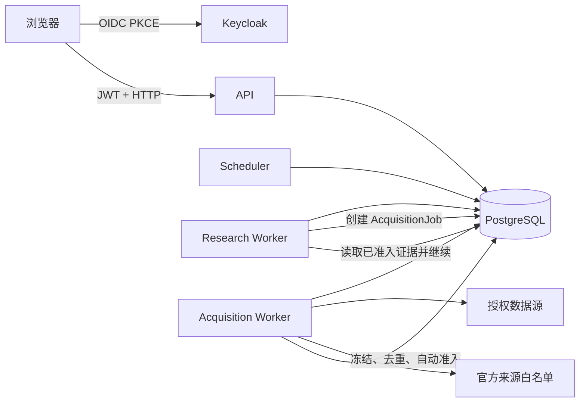

# 受治理的自动资料获取、可恢复运行与真实身份设计

日期：2026-08-12

## 1. 背景

当前系统已经具备事件 Case、研究范围、冻结资料、原子命题候选、自动研究运行、租户隔离和浏览器页面，但四条关键链路仍不完整：

1. 自动研究主要消费已经附加到 Case 的资料，不能根据补证目标主动寻找外部资料。
2. 现有浏览器验收仍混有 Mock、辅助 API 数据准备或单进程假设，不能证明真实主链在 API/worker 重启后可恢复。
3. `docker-compose.yml` 只提供 PostgreSQL 和 Neo4j，没有把 API、worker、scheduler、身份和运行观测组成一套可启动拓扑。
4. 现有 bearer token 主要映射租户和角色，部分写接口仍接受客户端提供的 `reviewer`、`actor` 或 `X-Actor`，不能证明实际操作人。

本设计把四项建设分成独立阶段，优先建立真正的资料获取模块，并避免直接修改正在开发的自动研究正确性分支。本文取代此前任何只描述“给 `AutoResearchService` 增加 source adapter”的草案；后续实施计划以本文为准。

## 2. 已确认的产品边界

### 2.1 来源范围

第一版采用“授权数据源 + 官方公开来源白名单”：

- 授权数据源：恒生聚源等已配置许可和访问凭证的提供商；
- 官方公开来源：证券交易所、上市公司投资者关系网站、监管机构、统计机构；
- 不使用通用搜索引擎抓取任意网页；
- 不自动跟随到白名单之外的域名；
- 每个来源通过独立 adapter 接入，来源能力和许可由版本化 SourcePolicy 决定。

### 2.2 无人值守自动入证

第一版不设置人工审核阻塞点。系统允许机器抽取结果直接进入正式证据链，但必须满足全部自动准入门禁：

1. 来源通过授权或官方白名单校验；
2. 发布时间明确且不晚于当前研究 HistoricalBasis 的 cutoff；
3. 每个命题都能回到冻结原文的页码、段落、字符区间或表格单元格；
4. 主体、指标、期间、单位和数值通过结构化一致性校验；
5. 来源许可允许 AI 处理和当前用途；
6. 抽取器和门禁版本均被记录，可完整重放。

通过后记录 `AutomaticAdmissionDecision`，并生成明确标记为 `automatically_admitted` 的 SourceStatement/EvidenceLink。它可以参与自动研究，但绝不能伪装成 `reviewed` 或人工作出的 ReviewDecision。

未通过的资料进入异常队列。原始资料和失败原因继续保留，其他资料照常处理，不阻塞整轮研究。

### 2.3 最终输出标识

只要研究结论使用了任何自动准入且未人工复核的证据，结论、导出和页面都必须显示：

> 系统生成，未经人工审核

后续人工复核可以追加 ReviewDecision，但不得改写或删除原 AutomaticAdmissionDecision。

## 3. 总体架构



采用模块化单体和共享 PostgreSQL，而不是第一版就拆成独立微服务：

- API、Research Worker、Acquisition Worker 和 Scheduler 使用同一个应用镜像、不同启动命令；
- 资料获取是独立的深模块，有自己的持久化状态机和 worker；
- 自动研究只提交 AcquisitionJob、读取结果，不知道来源网站、分页、下载或去重细节；
- PostgreSQL 是唯一恢复依据，进程内状态不承担正确性；
- Keycloak 只负责登录和令牌，本系统负责 Case 权限与审计身份。

## 4. 资料获取模块

### 4.1 对外接口

模块对业务调用方只暴露三个行为：

```python
class AcquisitionModule:
    def request(self, request: AcquisitionRequest, principal: ActorRef) -> AcquisitionJobRef: ...
    def get(self, job_id: UUID, principal: ActorRef) -> AcquisitionJobView: ...
    def admitted_evidence(self, job_id: UUID, principal: ActorRef) -> tuple[AdmittedEvidenceRef, ...]: ...
```

`AcquisitionRequest` 必须冻结以下研究语义：

- `tenant_id`、`case_id`、`thesis_id`；
- 可选 `research_run_id` 和补证轮次；
- EvidenceObjective：`support`、`contradict`、`alternative_explanation` 或 `verify_rule`；
- 待验证指标、主体、期间和允许的来源角色；
- HistoricalBasis cutoff；
- SourcePolicy 版本；
- 幂等键。

调用方不得传入供应商凭证、任意域名或“直接采纳”标志。

### 4.2 内部 seam

来源差异隐藏在两个内部接口后：

```python
class SourceAdapter(Protocol):
    descriptor: SourceDescriptor
    def search(self, request: SearchRequest) -> tuple[SourceReference, ...]: ...
    def fetch(self, reference: SourceReference) -> RetrievedEnvelope: ...
```

第一版 adapter：

- `GildataSourceAdapter`：授权研究报告和公司公告；
- `ExchangeAnnouncementAdapter`：按交易所拆分实现，但共享标准化 contract；
- `CompanyIRAdapter`：只处理已登记上市公司的官方 IR 域名；
- `RegulatorStatisticsAdapter`：监管和统计机构的版本化白名单。

一个来源只有真正实现了 search 和 fetch 两个行为才算 adapter。不能用一个“通用网页抓取器 + URL 参数”代替来源治理。

### 4.3 查询规划

`AcquisitionQueryPlanner` 根据 EvidenceObjective、实体别名、指标定义、期间和研究规则产生有限检索式。模型可以辅助生成同义词，但不能：

- 增加 SourcePolicy 未允许的来源；
- 改变 cutoff；
- 把“支持”任务改写成普通相关性搜索；
- 自己决定某条结果已经成为证据。

每条检索式连同 planner 版本、输入和目标写入任务事件，支持重放和问题定位。

### 4.4 持久化状态机

AcquisitionJob 状态：

```text
queued
  -> searching
  -> fetching
  -> freezing
  -> extracting
  -> admitting
  -> succeeded | partial | failed | cancelled
```

`retry_wait` 是可恢复等待状态，可从 search、fetch、freeze 或 parse 阶段进入。每次状态转换和每次 provider 调用都追加事件，不能只改一个可变 `status` 字段。

任务领取使用 PostgreSQL：

- `SELECT ... FOR UPDATE SKIP LOCKED`；
- `lease_owner`、`lease_token`、`lease_expires_at`；
- worker 仅能用当前 lease token 提交阶段结果；
- 进程崩溃后，其他 worker 在租约过期后接管；
- 指数退避带抖动，并遵守来源返回的限流时间；
- 非重试错误按单条 SourceReference 隔离，允许任务以 `partial` 完成。

任务幂等键至少由下列字段组成：

```text
tenant + case + research_run + thesis + objective + round + cutoff + source_policy_version
```

API 重启不会改变任务。Research Worker 重启后通过 job id 重新读取结果，不重复创建任务。Acquisition Worker 重启后从最后一个已提交阶段继续。

### 4.5 数据所有权

新增持久化记录按责任分开：

| 记录 | 性质 | 作用 |
|---|---|---|
| `acquisition_jobs` | 可变运行状态 | 当前阶段、租约、重试和计数 |
| `acquisition_job_events` | 只追加 | 用户可见进度和完整恢复轨迹 |
| `acquisition_attempts` | 只追加 | 每次 adapter 调用、耗时、结果和错误分类 |
| `source_references` | 只追加 | provider/publisher 返回的稳定引用及元数据 |
| `retrieval_artifacts` | 只追加 | 原始响应字节、哈希、响应信封和获取时间 |
| `automatic_admission_decisions` | 只追加 | 自动准入门禁的逐项结果和版本 |
| `acquisition_exceptions` | 只追加 | 隔离资料、失败门禁和可处理原因 |

`retrieval_artifacts` 不能复用“只有上传语义”的 `DocumentUploadArtifact` 名称。第一版原始字节存 PostgreSQL；同时保留 `storage_kind` 和 `object_version`，未来迁移对象存储时不改变资料身份。

任何 token、cookie、Authorization header 或供应商密钥都不得进入数据库、事件或日志。响应信封只保留允许列表中的内容类型、ETag、Last-Modified、最终 URL 和来源 request id。

### 4.6 冻结与三层去重

每次成功 fetch 都先冻结 RetrievalArtifact，再尝试生成或关联 DocumentVersion。即使后续解析失败或被判断为重复，原始获取事实仍可审计。

去重分三层：

1. **来源身份去重**：`adapter + external_record_id + external_version`，防止重复处理同一供应商记录；
2. **字节去重**：`SHA-256` 完全相同的内容复用 DocumentVersion；
3. **出版物去重**：标准化发行主体、资料类型、报告期间、发布日期和标题形成 publication key，用于识别同一资料的不同镜像。

第三层不允许静默丢弃字节不同的内容。系统保留所有 RetrievalArtifact，并创建 duplicate/variant 关系：

- 内容一致：关联到规范 DocumentVersion；
- 内容不同但出版物身份一致：标记 `variant_conflict`，进入异常队列，除非来源明确给出版本关系；
- 同 URL 内容改变：创建 superseding DocumentVersion，不覆盖旧版本。

### 4.7 自动准入门禁

`AutomaticAdmissionGate.evaluate(candidate, context)` 返回结构化决定，不返回裸布尔值。决定至少记录：

- SourcePolicy 版本和 adapter 身份；
- source gate：授权、域名、发行主体和来源类型；
- temporal gate：published_at、available_at 和 cutoff；
- locator gate：SourceSpan 定位可重放且原文哈希匹配；
- semantic gate：主体、指标、期间、单位、值和谓词一致；
- extraction model、prompt、parser 和 normalizer 版本；
- 每个门的输入摘要、结果和失败原因；
- 最终 `admitted` 或 `quarantined`。

机器置信度不能单独完成准入。缺失主体、期间、单位、发布日期或可重放定位时必须隔离。

自动准入成功后：

- 发布 SourceStatement，provenance 为 `automatic_admission_decision_id`；
- 生成与 EvidenceObjective 一致的 EvidenceLink；
- review state 使用 `automatically_admitted`，不能写成 `reviewed`；
- actor 使用运行身份，例如 `system:acquisition-worker` 和具体模型运行引用；
- 允许后续人工 ReviewDecision 确认、修正或撤销其有效性，但保留原记录。

## 5. 与自动研究的接入

### 5.1 隔离原则

资料获取内核先实现，暂不改 `AutoResearchService`。只有在以下现有工作完成集成后才进入接入阶段：

- `codex/auto-research-correctness` 的运行状态和审核门禁修复；
- `codex/source-category-successor` 的来源类型、合同和 provider identity 修复。

接入时只增加一个 orchestration seam：

```text
EvidenceTask
  -> AcquisitionModule.request(...)
  -> run 进入 waiting_for_acquisition
  -> AcquisitionJob terminal event
  -> Research Worker 读取 admitted_evidence(job_id)
  -> 继续 recall / assessment / conclusion
```

自动研究不得直接调用 adapter，也不得直接消费 search result 或 RetrievedEnvelope。

### 5.2 研究运行语义

Research Run 新增可见阶段：

- `planning_acquisition`；
- `waiting_for_acquisition`；
- `consuming_admitted_evidence`；
- `acquisition_exhausted`。

如果获取任务 `partial`，研究可以使用已经准入的证据，并在结论中披露遗漏来源和异常数量。如果所有资料都被隔离，研究结果只能是证据不足，不能根据搜索摘要生成结论。

## 6. 真实身份与 Case 权限

### 6.1 Keycloak 责任

部署环境附带 Keycloak：

- 前端使用 Authorization Code + PKCE；
- API 验证 JWT 签名、issuer、audience、expiry 和 not-before；
- API 通过 Keycloak JWKS 做密钥轮换；
- Keycloak 保存账号、凭证和基础租户声明；
- Keycloak 不保存具体 Case 授权。

### 6.2 内部身份

API 把 `(issuer, sub)` 映射到不可变的内部 UserPrincipal。显示名和邮箱只是属性，不能作为审计身份。

CaseGrant 支持：

- `viewer`：读取 Case 和冻结资料；
- `researcher`：编辑研究范围、启动研究和补证；
- `reviewer`：追加人工 ReviewDecision；
- `owner`：管理 CaseGrant 和归档 Case。

创建 Case 的用户自动获得 owner。租户管理员只能做显式、可审计的授权操作，不能因“同租户”自动看到所有 Case。

现有 CaseTenantAdmission 继续表达 Case 所属租户；新增 CaseGrant 表达用户级权限。这两个概念不能合并。

### 6.3 服务端 Actor

所有受保护写接口遵循：

```text
JWT -> UserPrincipal -> CaseGrant -> server_actor
```

- 人工 actor 格式统一为 `user:<internal_user_id>`；
- worker actor 使用固定系统身份并关联运行 id；
- 请求 DTO 移除 `reviewer`、`actor`、`approved_by` 等身份字段；
- 过渡期若客户端仍提交这些字段，服务端必须拒绝或忽略并记录兼容告警，绝不能用于审计；
- `X-Actor` 不再作为生产身份来源；
- 每个命令审计同时记录 principal、tenant、Case、所需权限和决策结果。

## 7. 可直接启动和监控的部署拓扑

### 7.1 服务组成

默认 Compose 拓扑：

| 服务 | 责任 |
|---|---|
| `postgres` | 账本、运行状态、租约、身份映射和 CaseGrant |
| `keycloak` | 登录、JWT 和测试 realm |
| `migrate` | 一次性执行 Alembic，成功后其他应用服务启动 |
| `api` | HTTP、OIDC 验证、授权和查询 |
| `research-worker` | 自动研究状态机 |
| `acquisition-worker` | 搜索、下载、冻结、去重和自动准入 |
| `scheduler` | 创建到期的监控和研究任务 |
| `frontend` | 构建后的真实 HTTP 客户端页面 |

Neo4j 作为可选 `graph` profile 保留，不是资料获取和恢复主链的必要条件。

### 7.2 启动和配置

- API、两类 worker 和 scheduler 使用同一个固定版本应用镜像；
- 所有镜像固定 digest 或明确版本，禁止使用漂移的 `latest`；
- provider 凭证只通过 secret/environment 注入 acquisition-worker；
- API 和 Research Worker 不持有 provider 密钥；
- Keycloak realm、client 和验收用户通过版本化 realm import 初始化；
- Compose healthcheck 必须区分 liveness 与 readiness；
- 数据迁移失败时应用服务不得启动到 ready。

### 7.3 运行观测

API 提供：

- `/health/live`：进程存活；
- `/health/ready`：数据库、迁移版本和 Keycloak JWKS 可用；
- `/api/v1/runtime/status`：各 worker/scheduler 心跳、最后任务和积压；
- `/metrics`：任务计数、阶段耗时、重试、租约接管、来源错误和隔离原因。

每个 worker 和 scheduler 使用独立实例 id 写心跳。状态页不能用旧 Case 状态代替缺失的运行记录；读不到心跳时明确显示 unavailable/stale。

日志使用结构化 JSON，至少含 `request_id`、`trace_id`、`tenant_id`、`case_id`、`research_run_id`、`acquisition_job_id`、`actor` 和 `source_adapter`，但不含正文、令牌和供应商凭证。

## 8. 不使用 Mock 的真实浏览器主链验收

### 8.1 验收约束

真实验收必须满足：

- 前端 Mock 开关关闭；
- 使用生产 HTTP adapter；
- 通过 Keycloak 登录页面获取真实 JWT；
- 业务数据只通过用户可见页面和公开 HTTP 命令产生；
- 验收脚本禁止执行 SQL 写入和 ORM fixture；
- 使用真实 Research Worker 和 Acquisition Worker；
- 外部资料来自授权提供商测试/生产许可环境或官方白名单站点；
- 重启由 Compose 控制面执行，不通过修改数据库伪造状态。

普通单元测试仍可使用 fake adapter 验证错误分支；“不使用 Mock”专指真实主链验收，不能取消必要的低层确定性测试。

### 8.2 主场景

Playwright 主场景：

1. 研究员通过 Keycloak 登录；
2. 从页面创建事件 Case，并完成研究范围和可验证命题；
3. 页面启动自动研究；
4. Research Worker 创建 AcquisitionJob；
5. Acquisition Worker 主动搜索授权源和官方白名单，冻结原始资料并展示来源进度；
6. 自动门禁通过的命题进入正式证据链，异常资料显示在异常队列；
7. Research Worker 消费已准入证据并形成系统结论；
8. 页面显示每一步、来源回链以及“系统生成，未经人工审核”；
9. 同一用户刷新或重新登录后仍能看到一致状态；
10. 无权限用户访问 Case 得到不泄露 Case 存在性的 404。

### 8.3 重启恢复场景

同一验收中注入三次真实进程故障：

1. 创建 AcquisitionJob 后重启 API，浏览器恢复连接且任务继续；
2. Acquisition Worker 冻结至少一份资料后强制退出，租约过期后新 worker 接管；
3. 自动证据已经准入、结论尚未形成时重启 Research Worker，新 worker 从持久化事件继续。

验收只通过页面和公开运行状态接口判断故障注入时机。验收环境允许缩短租约，但不允许跳过租约逻辑。

最终必须证明：

- 没有重复 DocumentVersion、SourceStatement、EvidenceLink 或运行事件；
- 原始 RetrievalArtifact 数量与每次实际获取相符；
- 第二次执行同一补证目标报告 duplicate/reused，而不是再生成证据；
- reviewer/actor 来自登录用户或系统运行身份；
- 浏览器全过程没有进入 mock client。

### 8.4 测试分层

- PR：adapter contract、状态机、租约、去重、门禁、授权的确定性测试；
- Compose 集成：本地受控 HTTP source server，只验证协议与故障恢复，不冒充真实验收；
- Live acceptance：需要真实 provider credential 和官方来源，手动或夜间运行；
- Live acceptance 缺少凭证时必须显示 skipped/unavailable，不能用 fixture 回退后仍声称通过。

## 9. 分阶段实施与冲突隔离

### 阶段 0：整合当前工作

- 先完成或明确关闭 `codex/auto-research-correctness`；
- 审核并整合 `codex/source-category-successor`；
- 记录两者合并后的新基线 commit；
- 不把任何 worktree 的未提交文件复制到新实现分支。

### 阶段 1：资料获取内核

- 新建独立实现 worktree；
- 新增 acquisition domain、表、repository、adapter contract、白名单策略、worker 和测试；
- 复用既有 DocumentVersion、SourceContract 和 ProviderRecord 的稳定接口；
- 不修改 AutoResearchService；
- 提供内部命令或受保护 API 单独发起 AcquisitionJob，完成模块级真实检索验收。

### 阶段 2：自动研究接入

- 从阶段 0 的整合基线 rebase；
- 只通过 AcquisitionModule seam 接入；
- 增加 waiting/resume 状态和无人值守自动准入消费；
- 删除原子命题人工审核作为自动研究的强制阻塞，但保留人工复核能力。

### 阶段 3：部署与身份

- 增加统一镜像、Compose 服务、Keycloak realm、JWT 校验和 CaseGrant；
- 分路由移除客户端身份字段；
- 增加 worker/scheduler 健康、心跳、指标和运行状态页面；
- 使用兼容窗口迁移现有本地 bearer 配置，生产模式默认禁用旧方式。

### 阶段 4：真实浏览器验收

- 新增独立 Playwright live 配置，不复用 `dev:mock`；
- 建立 Compose 故障注入控制脚本；
- 运行完整 Case 主链和三次重启；
- 把 live acceptance 结果保存为带环境、版本、来源和时间的验收报告。

每个阶段独立提交、独立验证，前一阶段提供稳定 seam，后一阶段不得跨过 seam 直接依赖内部表结构。

## 10. 验收标准

### 资料获取

- 空 Case 资料范围也能依据 EvidenceObjective 主动搜索 B 类来源；
- 每个结果先有 SourceReference，再有 RetrievalArtifact，最后才可能有 DocumentVersion；
- 原始字节、来源身份、获取时间、许可和发布时点可回放；
- 三层去重经并发和重启后仍幂等；
- 门禁失败不会生成正式证据，且不阻塞其他结果；
- 自动准入证据可影响结论，但始终显示机器来源和未人工审核状态。

### 恢复与部署

- 一条命令可启动完整默认拓扑；
- API、Research Worker 或 Acquisition Worker 任意重启后任务可恢复；
- scheduler 多实例不会重复创建到期任务；
- 页面能区分 available、stale 和 unavailable，不能用旧 Case 状态伪装实时运行；
- 所有镜像、迁移和 SourcePolicy 版本可追溯。

### 身份与权限

- 未登录请求为 401，无权限 Case 请求为不泄露存在性的 404；
- Case 创建者成为 owner，其他用户必须通过 CaseGrant 获权；
- 客户端伪造 reviewer/actor 不会改变审计身份；
- 人工和系统 actor 可从每条重要写操作回溯到 UserPrincipal 或运行实例。

### 真实浏览器验收

- Playwright 通过 Keycloak UI 登录并全程使用真实 HTTP adapter；
- 测试无 SQL/ORM 数据写入；
- 使用真实来源并产生冻结原文；
- 三次进程重启后主链完成且无重复；
- 最终页面可从结论逐级回到证据、SourceSpan、DocumentVersion 和 RetrievalArtifact。

## 11. 非目标

- 第一版不抓取普通新闻、社交媒体或任意搜索引擎网页；
- 第一版不拆独立数据库或消息总线微服务；
- 第一版不引入 Temporal、Kafka 或外部任务队列；PostgreSQL 租约先满足恢复要求；
- 第一版不让模型修改 SourcePolicy 或 CaseGrant；
- 自动准入不等同于人工复核，不提供虚假的“已审核”状态；
- 不在设计分支中修改当前自动研究实现、合并其他工作或处理其未提交文件。

## 12. 主要风险与控制

- **官方站点结构变化**：adapter 独立版本化；解析失败进入异常队列；禁止通用抓取静默兜底。
- **来源内容后改**：保留 ETag/Last-Modified、最终 URL 和每次 RetrievalArtifact；不同字节生成新版本。
- **错误自动入证**：必须同时通过四类门禁；关键字段缺失时 fail closed；页面持续披露未经人工审核。
- **供应商限流或故障**：per-source backoff、熔断和 partial completion；不让单一来源阻塞整轮。
- **租约重复执行**：lease token fencing、唯一键和 append-only decision idempotency 共同防重。
- **分支冲突**：资料获取内核先保持独立，不触碰 AutoResearchService；接入只在现有正确性和来源分支整合后进行。
- **身份迁移遗漏**：路由清单逐项迁移；生产启动检查拒绝启用 client-supplied actor 模式。
